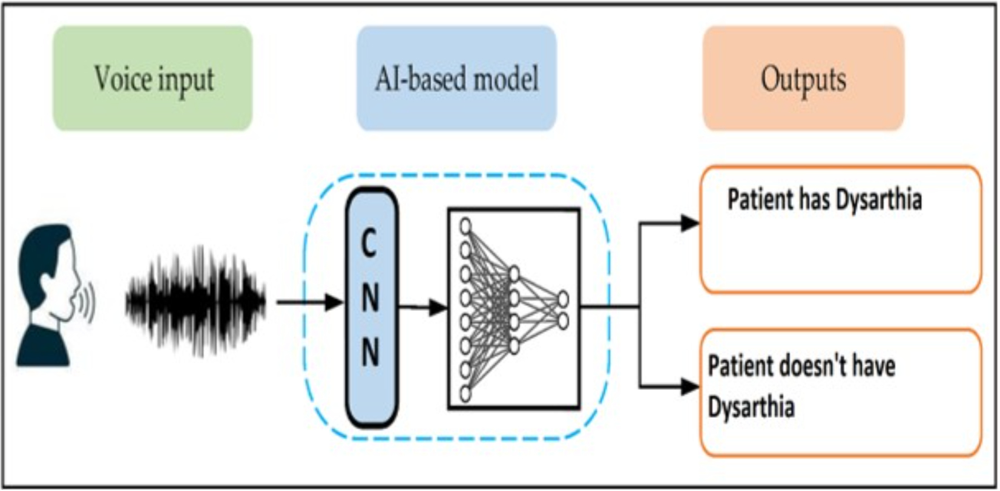

🧠 Speaking Disorder Detection Using Convolutional Neural Networks (CNN)

[](https://www.python.org/)
[](https://www.tensorflow.org/)
[](LICENSE)

> A deep learning solution to identify speaking disorders, specifically **dysarthria**, using **audio feature extraction** and **1D CNNs**.

---

## 📌 Project Overview

This project detects **dysarthric speech** using **Mel-Frequency Cepstral Coefficients (MFCC)** and other spectral audio features. The model classifies `.wav` files as either **normal** or **disordered** speech with high accuracy.

---

## 📂 Folder Structure

```
├── All Dys Wav/             # 🧑‍⚕️ Dysarthric audio samples (label: 1)
├── All Non Dys Wav/         # 🙂 Normal speech samples (label: 0)
├── Testing Dataset/         # 🧪 Additional unseen test samples
├── images/                  # 🖼️ Contains model diagram and screenshots
│   └── img1.png
├── Dysarthria_Detection.ipynb   # 🧠 Main training and evaluation notebook
├── README.md                # 📘 You are here
```

---

## 🔍 Feature Extraction

Speech files are processed using `librosa` to extract:
- MFCC (Mel-Frequency Cepstral Coefficients)
- Chroma Features
- Spectral Contrast
- Tonnetz
- Zero-Crossing Rate

---

## 🧠 CNN Model Architecture

| Layer Type     | Description                                  |
|----------------|----------------------------------------------|
| Conv1D         | Extracts patterns from MFCCs                 |
| MaxPooling1D   | Downsamples feature maps                     |
| Flatten        | Flattens output for dense layers             |
| Dense + Dropout| Fully connected layers to prevent overfitting|
| Softmax        | Final classification output layer            |

---

## 🧪 Sample Output

```
Input: dys_001.wav
Predicted Class: 1 (Dysarthric Speech)
Confidence: 93.4%
```

---

## ▶️ How to Run

1️⃣ **Clone the repository**
```bash
git clone https://github.com/Saim-Nadeem/Speaking-Disorder-Detection-Using-Convolutional-Neural-Networks-CNN-.git
cd Speaking-Disorder-Detection-Using-Convolutional-Neural-Networks-CNN-
```

2️⃣ **Install dependencies**
```bash
pip install -r requirements.txt
```

3️⃣ **Launch Jupyter Notebook**
```bash
jupyter notebook Dysarthria_Detection.ipynb
```

4️⃣ **Run all cells**
- Upload your test `.wav` files in the **Testing Dataset/** folder
- Watch the model predict normal or disordered speech

---

## 🛠 Requirements

- Python 3.9+
- TensorFlow
- Keras
- librosa
- scikit-learn
- numpy, pandas, matplotlib

---

## 🖼 Visual Overview



---


## 👤 Author

**Saim Nadeem**  
🔗 GitHub: [Saim-Nadeem](https://github.com/Saim-Nadeem)
